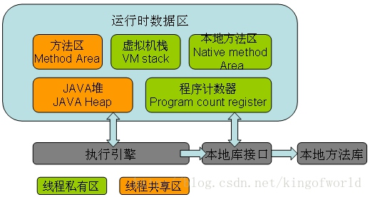
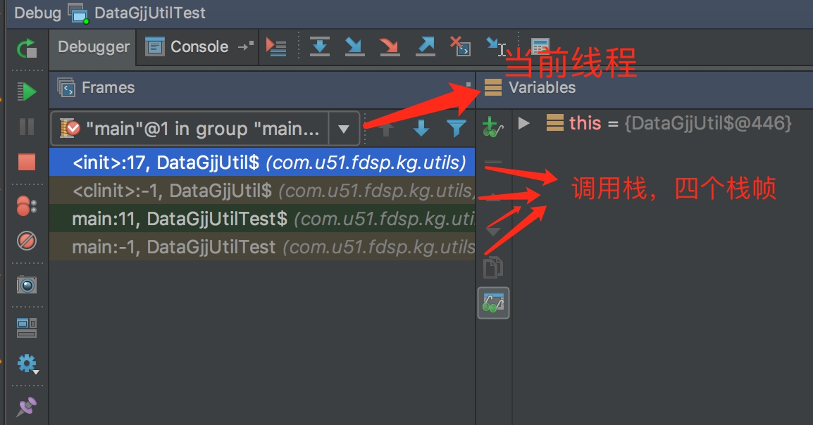

---
date: 2018-04-20
title: "Java内存区域与内存溢出异常"
author: "邓子明"
tags:
    - JVM
    - java
categories:
    - 深入理解java虚拟机
comment: true
---

## 一、概述
我们的代码运行过程中的，虚拟机管理着内存的分配和使用。我们今天先了解内存区域，使我们深入了解JVM的第一步。

## 二、运行时数据区域
根据java虚拟机规范，虚拟机内存区域结构大概如图，我们详细介绍每个区域：



### 1.程序计数器
1. 我们简单想象有个helloworld程序运行。代码最终是一步一步解释为机器码，所以有一个程序计数器，记录当前的代码执行位置，也就是行号。
2. 假如有两个线程执行helloworld，那每个线程执行到第几行都需要各自保存，每个线程都有独立的计数器。
3. 如果是循环打印，字节码需要改变程序计数器的值取到下一条指令。
4. 如果是java方法，计数器指向的是代码位置，如果是native方法，计数器为空。
5. 程序计数器是唯一一个没有 outofmermoryError情况的区域。

### 2. java虚拟机栈
1. 和程序计数器一样，java虚拟机栈也是线程私有。
2. 我们debug代码的时候，debugger会显示某个正在运行的线程，然后自上而下一次为每个方法对应的栈帧，每个栈帧保存局部变量等，每个方法执行结束，就有一个栈帧入栈到出栈：

3. 局部变量表存储的是各自基本数据类型（8种）和引用。64位的long和double占用两个变量空间，其余的是一个，一般来说，局部变量表的大小是固定的。
4. 栈有两种异常，Stack OverflowError 和 outofmermoryError，前者是方法调用栈太多，例如递归，后者是内存不够。

### 3.本地方法栈
和栈类似，主要负责本地方法，实现上很自由，有的直接和栈合二为一。也有两种异常。

### 4.java 堆
1. 内存最大，线程共享，作用就是存放实例（几乎所有的实例，但是技术发展导致没这么绝对）。
2. 垃圾回收采用分带收集，所以堆包括了新生代、老年代。还可以细分为：eden、from survivor、to survivor。
3. 可能也有线程私有的内存缓冲区，只是为了更好分配和回收。
4. 只要逻辑上连续即可，无需物理连续。大小可以调节（-Xmx和-Xms）
5. 无法扩展并且没有内存分配示例，会有OutOfmermoryError。

### 5.方法区
1. 我们运行了一个helloworld方法，对应的主类和常量、静态变量、编译后的代码都需要放在方法去，逻辑上和堆的一个部分。
2. 基本上不需要垃圾回收，所以有人叫他永久带，实际上只是一开始的JVM将它放在了永久代的而已。但是从1.7开始，已经把原本放在永久代的字符串常量池移出, 放在堆中。
3. 方法去无法满足内训分配需求，也会有OutOfmermoryError，但是从1.7开始，不在这样。
4. 类的元数据, 字符串池, 类的静态变量将会从永久代移除, 放入Java heap或者native memory.其中建议JVM的实现中将类的元数据放入 native memory, 将字符串池和类的静态变量放入java堆中. 这样可以加载多少类的元数据就不在由MaxPermSize控制, 而由系统的实际可用空间来控制.

### 6. 运行时常量池
1. 是方法区的一部分，.class 文件中除了有类的版本、字段、方法等信息，还有常量池，用于存放编译器的自变量和符号引用。这部分在加载后会进入方法去的运行时常量池。
2. .class文件的每一部分格式都很严格。但是常量池很宽松。
3. java语言并不要求一定要常量只能在编译时候产生，运行期间也可以将新的常量放入常量池。这种特性用的最多的是String的intern()方法。
4. 也会有OutOfmermoryError。

### 7. 直接内存
这部分是由于java的NIO引起的

## 三、Hotspot对象探秘
### 1.对象的创建

1. 从写代码看，对象的创建（例如克隆，反序列化）只是一个new关键字，然后我们调试可以看到其实还执行了 初始化的<init>方法。
2. 从虚拟机角度看，首先是检查对应的引用能否在常量池中定位到一个类的符号引用，并检查是否已经加载解析和初始化过，如果没有，就要开始加载。
3. 类的加载我们以后讨论，加载完后需要分配内存。对象大小在加载完成后就已经完全确定了，如果java堆内存是绝对规整的，那么需要维护一个指针指向当前分配到的位置。如果不连续需要维护一个空闲列表。
4. 分配内存可能是多线程的，有安全问题。要么加锁，要么给每个内存一个预先分配的小内存，成为本地分配缓存。
5. 内存分配完成后需要初始化为0值，然后进行元数据设置，例如是那个类的实例，GC代等。
6. 这时候对象创建才刚刚开始，执行 <init>方法。

### 2.对象的内存布局

1. 对象在内存中的存储布局可以分为3部分，对象头，实例数据、对象填充。对象头第一部分存储运行时数据，第二部分是类型指针。运行时数据hash码、分带年龄等。类型指针指向类元数据，数组还要记录数组长度。
2. 第二部分为实例数据，就是代码里面定义的数据内容
3. 第三部分没什么含义，仅仅是占位符。

### 3.对象的访问

1.对象的访问有两种方式，第一种是句柄。java堆会有一块专门的内存作为句柄池，栈存储的是句柄地址，句柄包含了对象示例数据（堆）和类型数据（方法区）各自的指针。
2. 第二中方法是指针访问，栈存储的直接是对象地址，堆的对象布局必须考虑如何放置访问类型数据。
3. 句柄最大的好处是对象改变时不需要改变栈的地址，使用直接内存好处是访问速度快，节省时间。

## 四、实战 OutOfmermoryError

除了程序计数器，都会有OutOfMermoryError异常，我们实战一下，在IDEA编写代码，并学习几个参数。

### 1.堆溢出


```java
/**
 * Created by dengziming on 17/04/2018.
 * VM ARGS: -Xms20m -Xmx20m -XX:+HeapDumpOnOutOfMemoryError
 */
public class HeapOOM {
    static class OOMObject{}
    public static void main(String[] args) {
        List<OOMObject> list = new ArrayList<>();
        while (true){list.add(new OOMObject());}
    }
}
```

VM ARGS:  -Xms20m -Xmx20m -XX:+HeapDumpOnOutOfMemoryError
马上报错：

```bash
java.lang.OutOfMemoryError: Java heap space
Dumping heap to java_pid98722.hprof ...
Heap dump file created [27798040 bytes in 0.363 secs]
Exception in thread "main" java.lang.OutOfMemoryError: Java heap space
	at java.util.Arrays.copyOf(Arrays.java:3210)
	at java.util.Arrays.copyOf(Arrays.java:3181)
	at java.util.ArrayList.grow(ArrayList.java:261)
	at java.util.ArrayList.ensureExplicitCapacity(ArrayList.java:235)
	at java.util.ArrayList.ensureCapacityInternal(ArrayList.java:227)
	at java.util.ArrayList.add(ArrayList.java:458)
	at io.github.dengziming.session2.HeapOOM.main(HeapOOM.java:21)
```

如何查看对文件和分析，我们后续有内容。简单分析两点：
1. 如果是内存泄露，通过GC工具查看泄露对象的GC引用链，定位代码位置
2. 如果内存溢出，可以考虑调大参数。 -Xmx -Xms

### 2.虚拟机栈和本地方法溢出

```java
/**
 * Created by dengziming on 18/04/2018.
 * VM ARGS -Xss128k
 */
public class JavaVMStackSOF {

    private int stackLenth = 1;
    public void stackLeak(){
        stackLenth ++;
        stackLeak();
    }

    public static void main(String[] args) {
        JavaVMStackSOF oom = new JavaVMStackSOF();
        try{
            oom.stackLeak();
        }catch (Exception e){
            System.out.println("stackLenth: " + oom.stackLenth);
            throw e;
        }
    }
}
```

Exception in thread "main" java.lang.StackOverflowError
结果表明，单线程下，无论是栈帧太大还是栈容量太小，内存无法分配的时候，都是Stack Overflow，如果多线程到不太一样。

```java
/**
 * Created by dengziming on 18/04/2018.
 * VM ARGS: -Xss20M
 */
public class JavaVMStackOOM {
    private void dontStop(){
        while (true){}
    }
    public void stackLeakByStack(){
        while (true){
            Thread thread = new Thread() {
                @Override
                public void run() {
                    dontStop();
                }
            };
            thread.start();
        }
    }

    public static void main(String[] args) {
        JavaVMStackOOM oom = new JavaVMStackOOM();
        oom.stackLeakByStack();
    }
}
```
运行完电脑卡死了，算了。这个内存越大反而容易耗尽资源，因为机器内存是固定的，减少容量可以获得更多的线程数。
注意：这时候通过减少内存解决内存溢出的方法，没有经验是不知道的。

### 3. 方法区和运行时常量池溢出
String.intern() 的含义是返回在代表常量池中这个字符串的对象。如果没有，就将这个字符串放进常量池，并返回引用。

```java
/**
 * Created by dengziming on 18/04/2018.
 * 
 * vm args: -XX:PermSize=10M -XX:MaxPermSize=10M
 */
public class RuntimeConstantPoolOOM {

    public static void main(String[] args) {

        List<String> list = new ArrayList<>();
        int i=0;
        while(true){
            list.add(String.valueOf(i++).intern());
        }
    }
}
```

不好意思这个方法没有达到效果：
Java HotSpot(TM) 64-Bit Server VM warning: ignoring option PermSize=10M; support was removed in 8.0
Java HotSpot(TM) 64-Bit Server VM warning: ignoring option MaxPermSize=10M; support was removed in 8.0
jdk1.7 已经把原本放在永久代的字符串常量池移出, 放在堆中。


```java
    public static void main(String[] args) {

        while(true){
            Enhancer enhancer = new Enhancer();
            enhancer.setSupperClass(OOMObject.class);
            enhancer.setUserCache(false);
            enhancer.setCallBack(new MethodInterceptor(){
                public Object intercept(Object obj , Method method , Object []args , MethodProxy proxy)throw Throwable{
                    return proxy.invokeSuper(obj , args);
                }
            });
            enhancer.create();
        }
    }
    static class OOMObject{

    }
```
这个也是一样。因为类的元数据, 字符串池, 类的静态变量从永久代移除, 放入Java heap或者native memory.其中建议JVM的实现中将类的元数据放入 native memory, 将字符串池和类的静态变量放入java堆中.


String.intern() 在1.6和1.7有不同的实现。

```java
public class RuntimeConstantPoolOOM2 {

    public static void main(String[] args) {

        String str1 = new StringBuilder().append("计算机").append("软件").toString();
        System.out.println(str1.intern() == str1);

        String str2 = new StringBuilder().append("ja").append("va").toString();
        System.out.println(str2.intern() == str2);
    }
}
```
1.6输出为false和false
1.7输出为true和false
原因是：1.6 的 intern返回在永久代的实例，如果是第一次遇到，会先复制到永久代。1.7不会复制到永久代，只是记录首次出现的实例的引用。
所以1.6的时候两个intern返回的是永久代的引用而不是字符串，1.7的时候 java 这个串已经出现过了。
