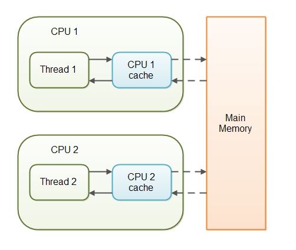

---
date: 2019-10-25
title: "Java并发编程-volatile"
author: "邓子明"
tags:
    - 并发编程
    - java
categories:
    - 并发编程
comment: true
---

## 一、概述

volatile 的意思是 "being stored in main memory", 详细点就是说对 volatile 变量的读和写都是操作 main memory，而不仅仅是 CPU cache.

但是在 jdk 1.5 以后的 volatile 有更多的用法

## 二、Variable Visibility Problems

下图反应了 volatile 的问题，




对于下面的代码：

```java
public class SharedObject {

    public int counter = 0;

}
```

如果有线程1 写 counter，而线程2读 counter，如果 counter 没有 volatile 修饰，可能出现下面的问题


熟悉数据库事务级别的，可以看出这类似于数据库中的幻读，貌似不是大问题，只要多读几次就行，但是读到的可能是 Obsolete 或者 stale 值。

加上 volatile 后，就不会出现这个问题了，

```java
public class SharedObject {

    public volatile int counter = 0;

}
```

Declaring a variable volatile thus guarantees the visibility for other threads of writes to that variable.
多线程程序中，声明一个变量是 volatile 可以保证其他线程对当前线程写操作的可见性。

In the scenario given above, where one thread (T1) modifies the counter, and another thread (T2) reads the counter (but never modifies it), declaring the counter variable volatile is enough to guarantee visibility for T2 of writes to the counter variable.
线程 T1 修改 counter，线程 T2 读 counter（T2 不会修改），通过 volatile 足够保证 T2 对 counter 的 visibility。

但是如果 T1 和 T2 都可以修改，那 volatile 就不够了。需要借助 synchronize 等方法来实现。


## 三、Full volatile Visibility Guarantee

这属于 volatile 的高级功能，实际上 volatile 不仅能保证自己的可见性，还可以保证同一个线程下其它变量的可见性，详细描述：

- If Thread A writes to a volatile variable and Thread B subsequently reads the same volatile variable, then all variables visible to Thread A before writing the volatile variable, will also be visible to Thread B after it has read the volatile variable.
- If Thread A reads a volatile variable, then all variables visible to Thread A when reading the volatile variable will also be re-read from main memory.

翻译过来就是：

- 线程 A 写 一个 volatile 变量，然后 B 读它，在 A 写 volatile 变量之前所有的 visible 变量，对 B 也是可见的。
- 线程 A 读一个 volatile 变量，所有的线程 A 的 visible 变量 都会 从 main memory 中 重新读取。

很拗口，我们举个例子：

```java

public class MyClass {
    private int years;
    private int months
    private volatile int days;


    public void update(int years, int months, int days){
        this.years  = years;
        this.months = months;
        this.days   = days;
    }
    
    public int totalDays() {
        int total = this.days;
        total += months * 30;
        total += years * 365;
        return total;
    }
}
```

虽然只有 days 是 volatile，但是 这个 update 方法将 days 写到 main memory 的时候，写之前可见的 years 和 months 也会写入 main memory。

同理 totalDays() 方法 将 days 读到 total 中的时候，当读 days 的时候，也会将 months 和 years 读到 main memory。


## Instruction Reordering Challenges

要注意上面的例子中，如果这里把 update 的顺序改为 `this.days   = days;` 最先执行，years 和 months 就不会写入 main memory 了。

那就出现了一个问题， 编码器在编码的时候可能会切换代码的顺序。

```java
int a = 1;
int b = 2;

a++;
b++;

 // 上面的代码编译的时候会切换成下面。
int a = 1;
a++;

int b = 2;
b++;
```

实际上 volatile 会保证 Happens-Before 的关系


## volatile is Not Always Enough


实际上我们上面也说了 volatile 不一定够用，有时候并发编程需要结合 synchronize，如下图，两个线程同时写


